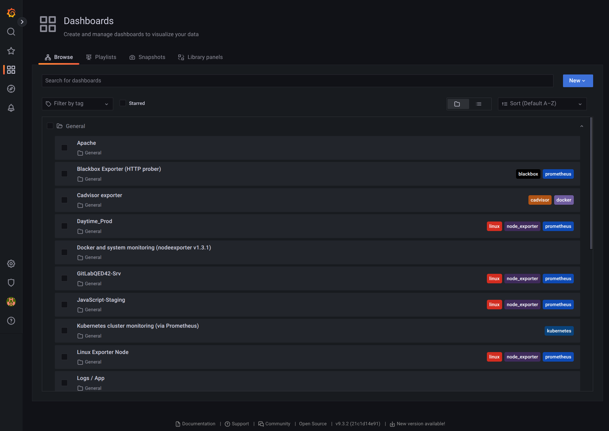
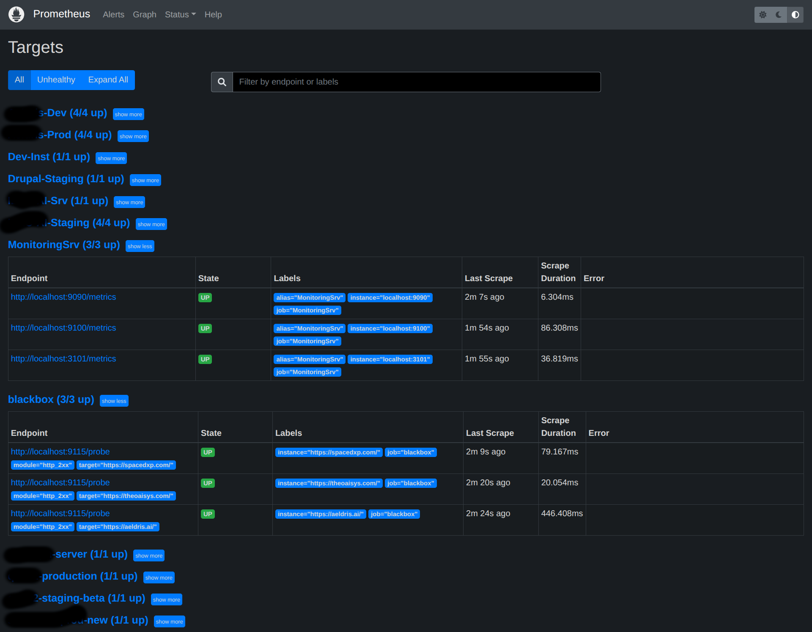
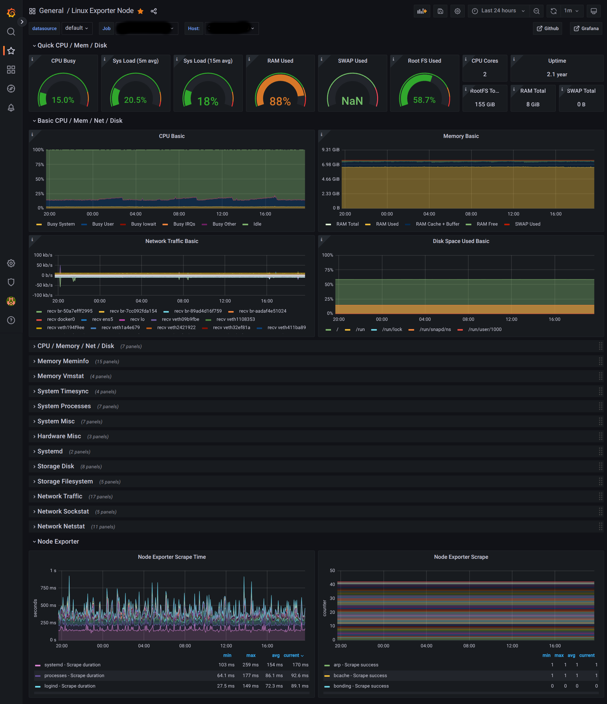
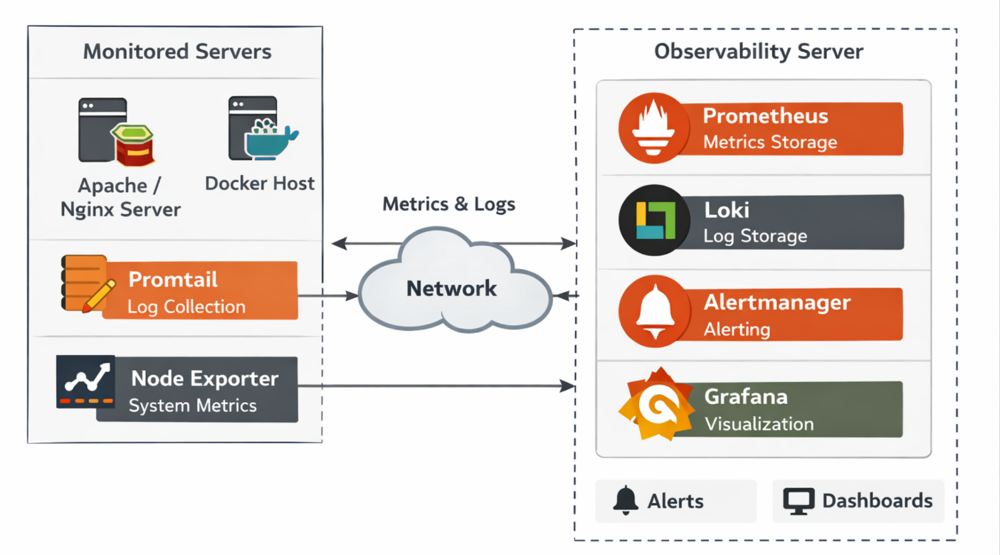

# DevOps Observability Stack

A lightweight DevOps observability stack built using Docker Compose for collecting metrics, logs, and infrastructure monitoring.

Components include Prometheus, Grafana, Loki, Promtail, Node Exporter, cAdvisor, and Alertmanager.

# Features

- Infrastructure monitoring
- Container monitoring
- Log aggregation
- Alerting with Prometheus
- Docker-based deployment

# Architecture

This repository contains the configuration required for monitored servers
to expose metrics and logs to an existing monitoring stack.

The monitoring backend (Prometheus, Grafana, Loki) runs on a central
observability server.

# Monitored Server Setup

Clone the repository

git clone https://github.com/joyjeetchakraborty/devops-observability-stack.git

cd devops-observability-stack

# Apache Monitoring

sudo cp apache2_conf-available_server-status.conf /etc/apache2/conf-available/server-status.conf

sudo a2enmod status

sudo a2enconf server-status

sudo systemctl restart apache2

Verify -

curl http://localhost/server-status?auto

# Nginx Monitoring

sudo cp nginx_conf.d_server-status.conf /etc/nginx/conf.d/server-status.conf

sudo nginx -t

sudo systemctl reload nginx

Verify -

curl http://localhost/server-status

# Promtail Setup

sudo mkdir -p /etc/promtail

sudo cp promtail-config.yml /etc/promtail/

sudo touch /etc/promtail/positions.yml

sudo chmod 666 /etc/promtail/positions.yml

# Start monitoring services

mv sample.env .env

nano .env

docker compose up -d

Verify -

docker ps

## Monitoring Backend

This repository assumes an existing observability server running:

- Prometheus
- Grafana
- Loki
- Alertmanager

The monitored servers send metrics and logs to this central stack.

## Screenshots

### Grafana Infrastructure Dashboard

### Prometheus Targets

### Node Exporter Aggregation

## Architecture

